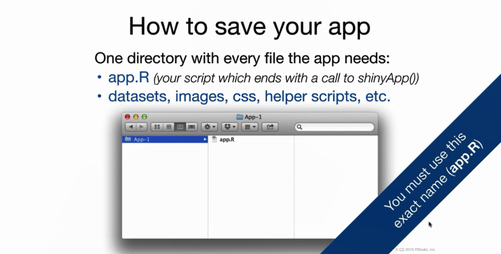
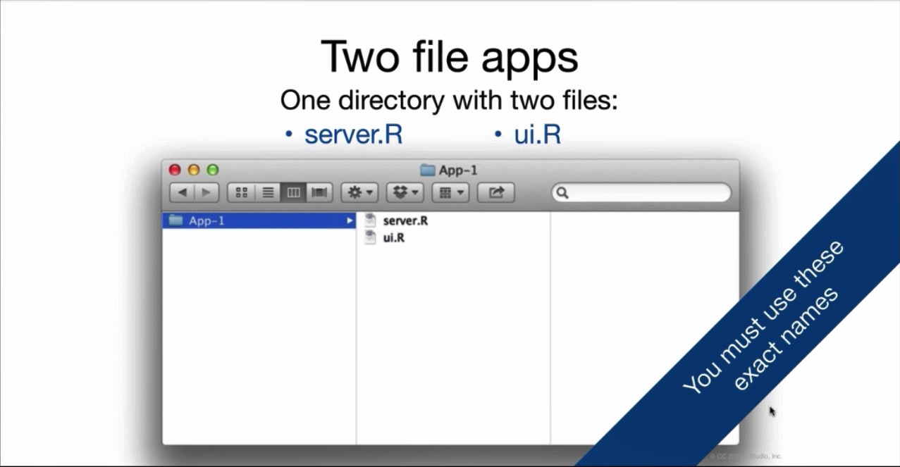

# Shiny and Web Crawler
## Shiny

https://www.youtube.com/watch?v=_0ORRJqctHE&list=PL6wLL_RojB5xNOhe2OTSd-DPkMLVY9DfB

https://shiny.rstudio.com/

https://shiny.rstudio.com/tutorial/


https://shiny.rstudio.com/images/shiny-cheatsheet.pdf

### Build Shiny

#### temple:
```{r eval=FALSE}
library(shiny)
ui=fluidPage()                      # make ui
server=function(input,output){}     # make server
shinyApp(ui=ui,server = server)     # make shiny
```

#### Sample 1 a+b+c shiny

make ui
```{r eval=FALSE}
library(shiny)
#ui
ui=fluidPage(titlePanel("Hello Shiny!"),                                      # title 
   sidebarLayout(                                                             # type of layout
    sidebarPanel(                                                             # left side panel
    numericInput(inputId = 'a','first number',0),                             # numericInput into a and defalt is 0 
    numericInput(inputId = 'b','second number',0),                            # numericInput into b and defalt is 0 
    sliderInput(inputId = 'c','third number',min = 1,max = 50,value = 30),    # numericInput into c and defalt is 30
    checkboxInput(inputId ='d','add 10',FALSE),                               # 1/0 into d and defalt is 0 
    dateInput(inputId='e', 'input date','2017-01-01'),                        # date input to e
    dateRangeInput('f',label = 'Date range input: yyyy-mm-dd',                # date range to f
                  start = Sys.Date() - 2, end = Sys.Date() + 2),
    selectInput('g',label='select cyl',c(999,unique(mtcars$cyl)))             # selectInput to g
     ),
  mainPanel(                                    # right main panel
    textOutput('z1'),                           # output  z1
    verbatimTextOutput("z2"),                   #  output  z2
    verbatimTextOutput("z3"),                   #  output  z3
    tableOutput("z4"),                          #  output table  z4
    plotOutput('z5')                            # output chart z5
    )
 )
)
```


make server:
```{r eval=FALSE}
# server
server=function(input,output){ 
  output$z1=renderText({input$a+input$b+input$c+input$d*10})           # output  number (z1 =a+b+c+d) as text 
  output$z2=renderText({as.character(input$e)})                         # output date z2 as text
  output$z3=renderText({as.character(input$f)})                         # output date z3 as text
  output$z4=renderTable({mtcars%>%filter(cyl==input$g)})                # output date z4 as table
  output$z5=renderPlot({ggplot(mtcars%>%filter(cyl==input$g),aes(mpg,wt))+geom_point()}) # output date z5 as plot
}
```
make shiny:
```{r eval=FALSE}
#shiny
shinyApp(ui=ui,server = server)
```


#### Sample 2 one way reactive shiny 

make ui:
```{r eval=FALSE}
library(shiny)
library(ggplot2)

ui=fluidPage(titlePanel("Hello Shiny!"),                                                   # title 
             sidebarLayout(                                                                # type of layout
               sidebarPanel(                                                               # left side panel
                 numericInput(inputId = 'a','first number',0),                             # numericInput into a and defalt is 0 
                 numericInput(inputId = 'b','second number',0),                            # numericInput into b and defalt is 0 
                 sliderInput(inputId = 'c','third number',min = 1,max = 50,value = 30),    # sliderInput into c and defalt is 30
                 checkboxInput(inputId ='d','add 10',FALSE),                               # 1/0 into d and defalt is 0 
                 dateInput(inputId='e', 'input date','2017-01-01'),                        # date input to e
                 dateRangeInput('f',label = 'Date range input: yyyy-mm-dd',                # date range to f
                                start = Sys.Date() - 2, end = Sys.Date() + 2),
                 selectInput('g',label='select cyl',c(999,unique(mtcars$cyl))),                    # selectInput cyl to g
                 sliderInput('h',label='select hp', min(mtcars$hp),max(mtcars$hp),median(mtcars$hp)),    # sliderInput hp to h
                 radioButtons('i',label='choose vs',unique(mtcars$vs))         # radioButtons vs to i
               ),
               mainPanel(                                        # right main panel
                 textOutput('z1'),                                   # output  z1
                 verbatimTextOutput("z2"),                        #  output  z2
                 verbatimTextOutput("z3"),                        #  output  z3
                 tableOutput("z4"),                                #  output table  z4
                 plotOutput('z5'),                                   # output chart z5
                 verbatimTextOutput('z6') ,                       # output summary z6
                 tableOutput('z7')                        # output head data z7
               )
             )
)
```


make server:
```{r eval=FALSE}
server=function(input,output){
  data001=reactive({mtcars%>%filter(vs==input$i)})             # make a reactive data001() base on input i
  
  output$z1=renderText({input$a+input$b+input$c+input$d*10})           # output  number (z1 =a+b+c+d) as text 
  output$z2=renderText({as.character(input$e)})                         # output date to z2 as text
  output$z3=renderText({as.character(input$f)})                         # output date to z3 as text
  output$z4=renderTable({mtcars%>%filter(cyl==input$g)})                # output date to z4 as table
  output$z5=renderPlot({ggplot(mtcars%>%filter(cyl==input$g),aes(mpg,wt))+geom_point()})     # output date z4 as table
  output$z6=renderPrint({summary(data001())})                           #output summary to z6 as print
  output$z7=renderTable({head(data001())})                             #output head to z7 as print
  }
```
make shiny:
```{r eval=FALSE}
#shiny
shinyApp(ui=ui,server = server)
```


#### Sample 3 two way reactive shiny 

#### Sample 4 tab shiny


### share your shiny 

One file:
```{r echo=FALSE, out.width='100%'}

```

Two file:
```{r echo=FALSE, out.width='100%'}

```

#### www.shinyapps.io 

#### Shiny Server

## Shiny Dashboard

## Web Crawler

### RCurl; rvest


### sample 1 :Wework
```{r echo=FALSE}
location_url='https://www.wework.com/locations'    #url

location_html=readLines(location_url)              # location html

sink("location_html.html")                         # save location html to "location_html.html"
cat(location_html)
sink()

location_html_r=read_html("location_html.html")    # read in "location_html.html"

location_names=location_html_r%>%html_nodes('li.marketListItem__countryList__2KKre a')%>%html_text() #location_names
location_names2=location_names[1:(length(location_names)/2)]

location_url=location_html_r%>%html_nodes('li.marketListItem__countryList__2KKre a')%>%html_attr("href") #location_names_url
location_url2=location_url[1:(length(location_url)/2)]

location_url3=paste('https://www.wework.com',location_url2,sep='')    

office_html_r=read_html(location_url3[1])   # first location html


office_names=office_html_r%>%html_nodes('.titleContainer__buildingCard__jJ9-z h3')%>%html_text()  # first location office names 
office_names

office_price=office_html_r%>%html_nodes('.sm10 span')%>%html_text()   # first location office price 
office_price

office_address=office_html_r%>%html_nodes('.titleContainer__buildingCard__jJ9-z div')%>%html_text() # first location office address 
office_address

office_desc=office_html_r%>%html_nodes('div.descriptionCard__geogrouping__FnElF p')%>%html_text() # first location office description
office_desc


############################## loop over all location and print all locations office name #####################
for (i in location_url3){
    print(i)
    office_names=read_html(i)%>%html_nodes('.title__buildingCard__1AK3U')%>%html_text()
    print(office_names)
}
```


