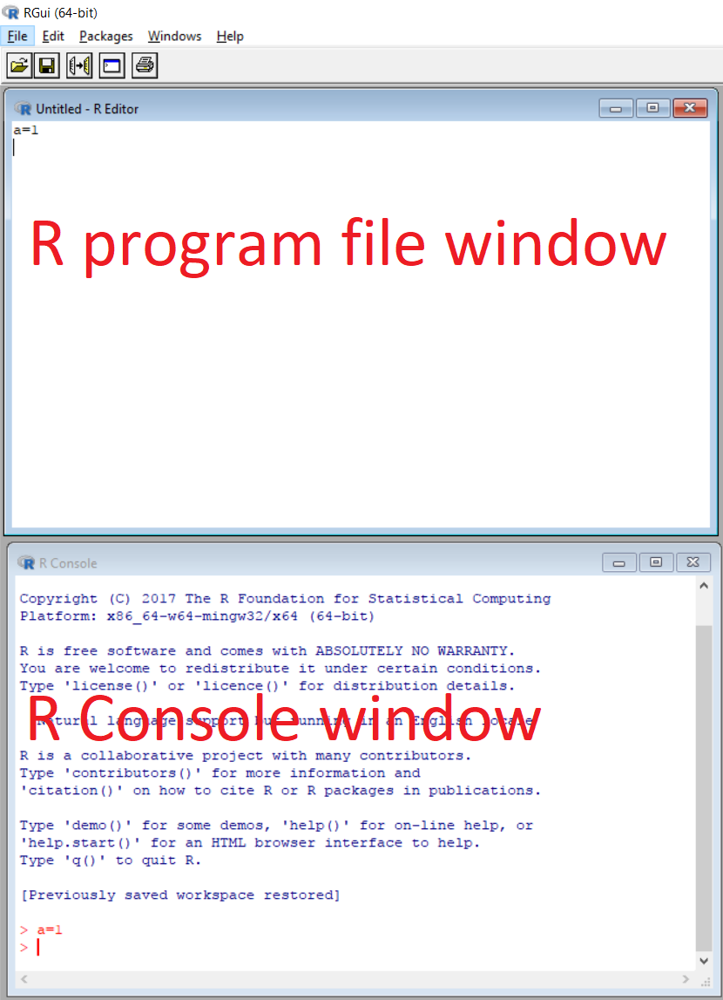
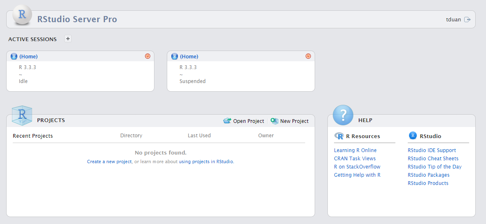
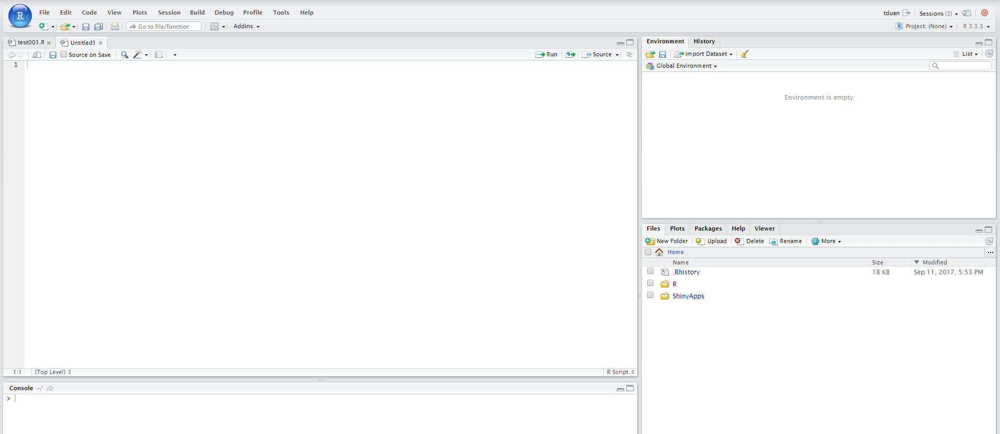

# Introduction {#intro}

## History of analytic software
**R** is an implementation of the **S** programming language and created by *Ross Ihaka* and *Robert Gentleman*. at the University of Auckland, New Zealand.R is named partly after the first names of the first two R authors and partly as a play on the name of S. The project was conceived in **1992**, with an initial version released in 1995 and a stable beta version in 2000.

**Python** is created by *Guido van Rossum* in **1991**.Python 3.0 was released on **2008**.

**S** is a statistical programming language developed primarily by *John Chambers* at Bell Laboratories in **1975**.

Structured Query Language[**SQL**] was initially developed at IBM by *Donald D. Chamberlin* and *Raymond F. Boyce* in **1970**.

*Cleve Moler*, the chairman of the computer science department at the University of New Mexico, started developing **MATLAB** in the late **1970**.

The development of **SAS** began in **1966** at North Carolina State University by *Anthony Barr* and his student *James Goodnight*(current CEO of SAS).


```{r eval = FALSE}
devtools::install_github("PMassicotte/gtrendsR")
library(gtrendsR)
res <- gtrends("sko", geo = "NO", cat = "18")
head(res$interest_over_time)
```
```{r echo = TRUE,message=FALSE}
library(plotly)
google_trend<- read.csv("multiTimeline001.csv", header=TRUE,skip=1)
p <- plot_ly(google_trend, x = ~Week, y = ~R...Worldwide.,name = 'R', type = 'scatter', mode = 'lines')%>%
  add_trace(y = ~SQL...Worldwide., name = 'SQL', mode = 'lines')%>%
  add_trace(y = ~Python...Worldwide., name = 'Python', mode = 'lines')%>%
    layout(title = "Past 5 years Google Trends",
       xaxis = list(title = "Date"),
       yaxis = list (title = "Interest"))
p
```


## Install R

R is a **free software** environment for statistical computing and graphics.Download R at CRAN:[www.r-project.org](https://www.r-project.org/)

**CRAN** stand for The Comprehensive R Archive Network. It is a network of ftp and web servers around the world that store identical, up-to-date, versions of code and documentation for R.

**CRAN** is maintained by the efforts of volunteers (the 'CRAN team').That is a group of talent who contribute their time and expertise to make better **Package**

## Install RStudio

RStudio is an **integrated development environment (IDE)** for R. It includes a console, syntax-highlighting editor that supports direct code execution, as well as tools for plotting, history, debugging and workspace management.

Download R Studio:[www.rstudio.com](https://www.rstudio.com/)

## Software navigation

### R

```{r echo=FALSE, out.width='70%',out.length='50%'}

```

### Rstudio

```{r echo=FALSE, out.width='100%'}
knitr::include_graphics('./R_studio.png')
```

### Rstudio server(don't worry about it at the moment)

Rstudio server pro is able to run multi R section at the same time
```{r echo=FALSE, out.width='100%'}

```

Rstudio server display
```{r echo=FALSE, out.width='100%'}

```


## Version and location

Check R version:
```{r message=FALSE}
version
```

update R version run:
```{r eval=FALSE}
install.packages("installr")
library(installr)
updateR()
```
