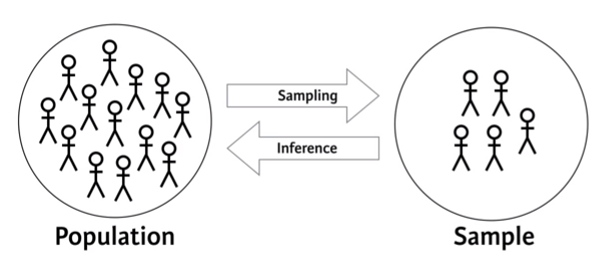

# Data Modeling 

## statistic
```{r echo=FALSE, out.width='50%'}

```
### sampling


### statistic distribution 

### statistic Test and inference
chi-square, t-test, ANOVA, correlation
## Modeling


### supervised learning
Supervised learning is the machine learning task of inferring a function from labeled training data.[1] The training data consist of a set of training examples. In supervised learning, each example is a pair consisting of an input object (typically a vector) and a desired output value (also called the supervisory signal). A supervised learning algorithm analyzes the training data and produces an inferred function, which can be used for mapping new examples.


#### Linear regression

Regression to the mean by Francis Galton

Regression to the mean is a statistical phenomenon that can make natural variation in repeated data look like real change. It happens when unusually large or small measurements tend to be followed by measurements that are closer to the mean.

"Regression to the mean is so powerful that once-in-a-generation talent basically never sires once-in-a-generation talent. It explains why Michael Jordan’s sons were middling college basketball players and Jakob Dylan wrote two good songs. It is why there are no American parent-child pairs among Hall of Fame players in any major professional sports league."
by economist Seth Stephens-Davidowitz

linear regression is a linear approach for modeling the relationship between a scalar dependent variable y and one or more explanatory variables (or independent variables) denoted X


##### Simple linear regression

One of the regression model,using one vairable to predict a continual target
```{r}
library(ggplot2)
# Scatterplot with regression line
ggplot(data = mtcars, aes(x = mpg, y = wt)) + 
  geom_point() + 
  geom_smooth(method = "lm")
```


Find the Equation : 
$$Y=\beta_0+\beta_1*X$$

Residuals:
$$e=Y-\hat{x}$$

So that minimize:
$$\sum_{i=1}^n e_i^2$$

Fit a model:
```{r}
mod=lm(wt ~ mpg, data = mtcars)# mpg to predict wt
mod
#coef(mod)
class(mod)
summary(mod)

head(fitted.values(mod))
```

Using broom package to get the predict value and residue :
```{r eval=FALSE}
#install.packages('broom')
library(broom)
head(augment(mod))

```

make a prediction
```{r eval=FALSE}
#install.packages('broom')
library(broom)
library(dplyr)
head(augment(mod)%>%select(wt,mpg,.fitted,.se.fit))

```


Outlier impact:leverage:the distance of that observation from the mean of the explanatory variable

```{r eval=FALSE}
#install.packages('broom')
library(broom)
library(dplyr)
augment(mod)%>%select(wt,mpg,.fitted,.hat)%>%arrange(desc(.hat))%>%head()
```


Outlier impact:Influence:using Cook's distance, which incorporates both the leverage and residual of each observation.
```{r eval=FALSE}
#install.packages('broom')
library(broom)
library(dplyr)
augment(mod)%>%select(wt,mpg,.fitted,.cooksd)%>%arrange(desc(.cooksd))%>%head()
```


##### Multi linear regression
One of the regression model,using Multi vairables to predict a continual target

caret package


#### Logistic regression
classification model


#### Random forest
classification model
#### Support Vector Machine

#### Association rule learning
classification model
#### Neural Network


#### Forecasting and ARIMA Modeling 


### unsupervised learning
Unsupervised machine learning is the machine learning task of inferring a function to describe hidden structure from "unlabeled" data (a classification or categorization is not included in the observations).for example,finding  subgroups within larget group or finding patterns in the features of the data.

#### Grouping 
Data on differenct scales can cause undesirable result in clustering.
we should normalized the input data before clustering.

Normalization:
```{r eval=FALSE}
# View column means
colMeans(x)
# View column standard deviations
apply(x, 2, sd)
# normalized data
scaled_data=scale(x)

```

##### K mean clusting
1.pre defined number of groups;2.random assign each observation to the groups;3.find center of each group;4.re-assign each observation to the close center;5.restart next iteration and stop when no point change.

kmeans:
```{r eval=FALSE}
# data,2 group and 20 time start center and max iteration 50 run
km.out=kmeans(x,centers = 2,nstart = 20,iter.max = 50)
summary(km.out)
```


Find the Elbow on scree plot to determind the numbers of group:
```{r}
# Initialize total within sum of squares error: wss
wss <- 0
# For 1 to 15 cluster centers
for (i in 1:15) {
  km.out <- kmeans(iris[-5], centers = i, nstart = 20,iter.max = 50)
  # Save total within sum of squares to wss variable
  wss[i] <- km.out$tot.withinss
}
# Plot total within sum of squares vs. number of clusters
plot(1:15, wss, type = "b", 
     xlab = "Number of Clusters", 
     ylab = "Within groups sum of squares")
```

##### hierarchical clustering
group the close point to a group and group close group to a bigger group until its become a group and measure the distance between group 
```{r}
# Create hierarchical clustering model: hclust.out
hclust.out <- hclust(dist(iris[-5]))
# Inspect the result
summary(hclust.out)
# to determind the numbers of group:
#Dendrogram
plot(hclust.out)
```


```{r eval=FALSE}
# Cut by height
cutree(hclust.out, h = 7)
# Cut by number of clusters
cutree(hclust.out, k = 3)
```
Hierarchical clustering with complete,average,single method:
```{r eval=FALSE}
# Cluster using complete linkage: hclust.complete
hclust.complete <- hclust(dist(x), method = "complete")
# Cluster using average linkage: hclust.average
hclust.average <- hclust(dist(x), method = "average")
# Cluster using single linkage: hclust.single
hclust.single <- hclust(dist(x), method = "single")
# Plot dendrogram of hclust.complete
plot(hclust.complete, main = "Complete")
# Plot dendrogram of hclust.average
plot(hclust.average, main = "Average")
```


#### Dimensionality Reduction 
Find structure in features and Aid in visualization.


##### Principal Component Analysis (PCA) 
1.Find linear combniation of vaiables to create principa components.
2.Maintain most vairance in the data
3.Principal components are uncorrelated.
```{r }
# Perform scaled PCA: pr.out
pr.out <- prcomp(iris[-5], scale = TRUE,center = TRUE)#scale = TRUE : scale all variable
# Inspect model output
summary(pr.out)
```


Scree plot and Biplot
```{r }
# Variability of each principal component: pr.var
pr.var <- pr.out$sdev^2
# Variance explained by each principal component: pve
pve <- pr.var / sum(pr.var)
#Scree plot
# Plot variance explained for each principal component
plot(pve, xlab = "Principal Component",
     ylab = "Proportion of Variance Explained",
     ylim = c(0, 1), type = "b")
#Biplot
biplot(pr.out)
```

Practical issue with PCA:

1. Scaling the data
2. Missing values:Drop observiation or estimate missing values
3. Categoriacal data: do not use categoriacal data or encode categorical feature to number

##### Linear Discriminant Analysis (LDA)
TBD
## A/B testing

## Causation Analysis

## Sentiment Analysis
TBD
## Parallel computing
TBD
