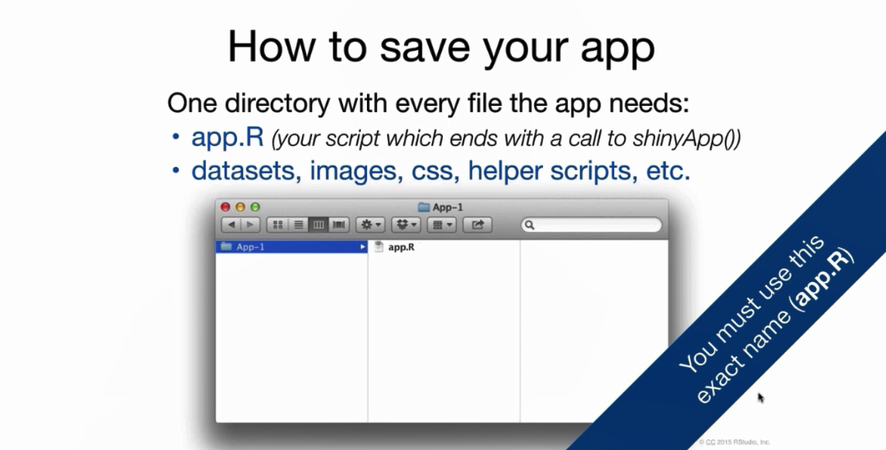
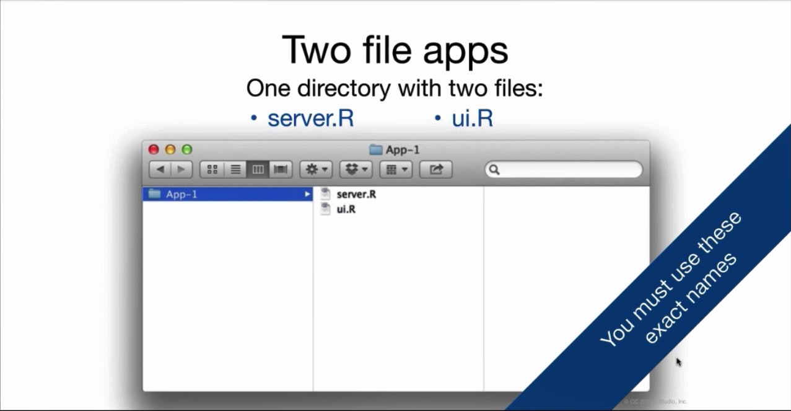

# Shiny and Web Crawler
## Shiny

https://www.youtube.com/watch?v=_0ORRJqctHE&list=PL6wLL_RojB5xNOhe2OTSd-DPkMLVY9DfB

https://shiny.rstudio.com/

https://shiny.rstudio.com/tutorial/


https://shiny.rstudio.com/images/shiny-cheatsheet.pdf

### Build Shiny

#### temple:
```{r eval=FALSE}
library(shiny)
ui=fluidPage()                      # make ui
server=function(input,output){}     # make server
shinyApp(ui=ui,server = server)     # make shiny
```

#### Sample 1

make ui
```{r eval=FALSE}
library(shiny)
#ui
ui=fluidPage(titlePanel("Hello Shiny!"),                                      # title 
   sidebarLayout(                                                             # type of layout
    sidebarPanel(                                                             # left side panel
    numericInput(inputId = 'a','first number',0),                             # numericInput into a and defalt is 0 
    numericInput(inputId = 'b','second number',0),                            # numericInput into b and defalt is 0 
    sliderInput(inputId = 'c','third number',min = 1,max = 50,value = 30),    # numericInput into c and defalt is 30
    checkboxInput(inputId ='d','add 10',FALSE),                               # 1/0 into d and defalt is 0 
    dateInput(inputId='e', 'input date','2017-01-01'),                        # date input to e
    dateRangeInput('f',label = 'Date range input: yyyy-mm-dd',                # date range to f
                  start = Sys.Date() - 2, end = Sys.Date() + 2),
    selectInput('g',label='select cyl',c(999,unique(mtcars$cyl)))             # selectInput to g
     ),
  mainPanel(                                    # right main panel
    textOutput('z1'),                           # output  z1
    verbatimTextOutput("z2"),                   #  output  z2
    verbatimTextOutput("z3"),                   #  output  z3
    tableOutput("z4"),                          #  output table  z4
    plotOutput('z5')                            # output chart z5
    )
 )
)
```


make server:
```{r eval=FALSE}
# server
server=function(input,output){ 
  output$z1=renderText({input$a+input$b+input$c+input$d*10})           # output  number (z1 =a+b+c+d) as text 
  output$z2=renderText({as.character(input$e)})                         # output date z2 as text
  output$z3=renderText({as.character(input$f)})                         # output date z3 as text
  output$z4=renderTable({mtcars%>%filter(cyl==input$g)})                # output date z4 as table
  output$z5=renderPlot({ggplot(mtcars%>%filter(cyl==input$g),aes(mpg,wt))+geom_point()}) # output date z5 as plot
}
```
make shiny:
```{r eval=FALSE}
#shiny
shinyApp(ui=ui,server = server)
```

#### Sample 2

### share your shiny 

One file:
```{r echo=FALSE, out.width='100%'}

```

Two file:
```{r echo=FALSE, out.width='100%'}

```

#### www.shinyapps.io 

#### Shiny Server

## Shiny Dashboard

## Web Crawler
