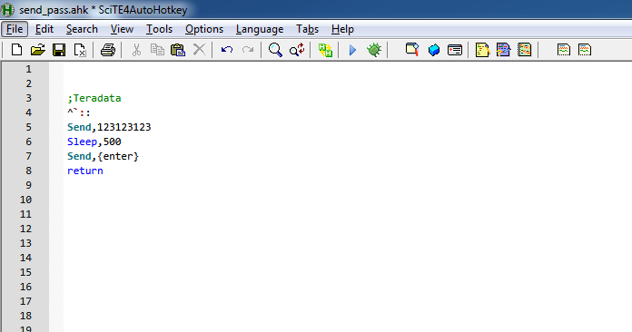
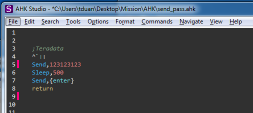
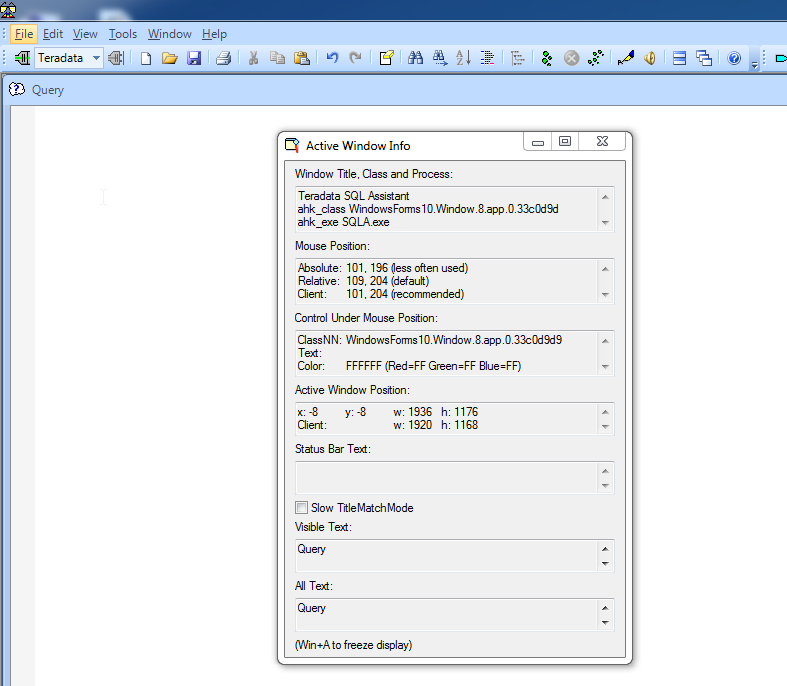

# Appendix


## The Giants
"If I have seen further, it is by standing on the shoulders of giants" by Isaac Newton.

Hadley Wickham

Joe Cheng

Yihui Xie 


## The Talk

useR! International R User 2017 Conference
Sponsor Talk - Data Camp by Jonathan Cornelissen CEO
https://channel9.msdn.com/Events/useR-international-R-User-conferences/useR-International-R-User-2017-Conference/Sponsor-Talk-Data-Camp


Expressing yourself in R by  Hadley Wickham on 2014 @Stanford Seminar
https://www.youtube.com/watch?v=wki0BqlztCo


All Things R and RStudio
Q&A with J.J. Allaire, Hadley Wickham & Joe Cheng
Moderator: Joseph Rickert
https://www.rstudio.com/resources/videos/all-things-r-and-rstudio/


Finding and Telling Stories with R
by Andrew Flowers from FiveThirtyEight
https://www.rstudio.com/resources/videos/finding-and-telling-stories-with-r/

install.packages('fivethirtyeight')
library(fivethirtyeight)

1.Novelty
2.Outlier
3.Archetype
4.Trend
5.Debunking
6.Forecast


## The Walk

follow the master,work with the master and become the master 


## Learning resource


## Reference

### web 
www.r-bloggers.com

www.rstudio.com

www.r-project.org

www.wikipedia.org

https://www.youtube.com/user/marinstatlectures/videos


### book
1.The Lady Tasting Tea by David Salsburg

2.The Art of R Programming by Norman Matloff 

3.R for Data Science by Hadley Wickham and Garrett Grolemund

4.Introduction to Statistical Learning(ISLR) by Gareth James,Daniela Witten and Trevor Hastie Robert Tibshirani


Learn R, in R.  http://swirlstats.com/
```{r eval=FALSE}
install.packages("swirl")
library("swirl")
swirl()
```

www.datacamp.com


## Appendix to the book To Chapter 3 : Google sheet
https://www.youtube.com/watch?v=7l2_R61jrUU&list=PLH6mU1kedUy-IW8mi46ZhowTm3-_yQNAQ


## Appendix to the book To Chapter 3 :Web Data and Big Data

finding the internet

### import Data from URL
```{r eval=FALSE}
# Direct import 
csv_url <- "http://s3.amazonaws.com/assets.datacamp.com/production/course_1561/datasets/chickwts.csv"
csv_data <- read.csv(file = csv_url)

# Download the file with download.file()
csv_url <- "http://s3.amazonaws.com/assets.datacamp.com/production/course_1561/datasets/chickwts.csv"
download.file(url = csv_url, destfile = "feed_data.csv")
# Read it in with read.csv()
csv_data <- read.csv(file = "feed_data.csv")
```

Save data to R-specific file format
```{r eval=FALSE}
# Save it to disk with saveRDS()
saveRDS(object = csv_data, file = "modified_feed_data.RDS")

# Read it back in with readRDS()
modified_feed_data <- readRDS(file = "modified_feed_data.RDS")
```

### API

#### API package
wiki API example: 
```{r eval=FALSE}
# Load pageviews
#install.packages('pageviews')
library(pageviews)

# Get the pageviews for "Hadley Wickham"
hadley_pageviews <- article_pageviews(article = "Hadley Wickham")

# Examine the resulting object
str(hadley_pageviews)
hadley_pageviews
```


Twitter API example: 

#### GET and POST request

GET request:
```{r eval=FALSE}
library(httr)
# Make a GET request to http://httpbin.org/get
get_result <- GET(url = "http://httpbin.org/get")

# Print it to inspect it
get_result
```

POST request:
```{r eval=FALSE}
# Load the httr package
library(httr)

# Make a POST request to http://httpbin.org/post with the body "this is a test"
post_result <- POST(url = "http://httpbin.org/post", body = "this is a test")

# Print it to inspect it
post_result
```

Get request content:
```{r eval=FALSE}
# Make a GET request to url and save the results
pageview_response <- GET(url)

# Call content() to retrieve the data the server sent back
pageview_data <- content(pageview_response)

# Examine the results with str()
str(pageview_data)
```

directory-based URL:
```{r eval=FALSE}
# Construct a directory-based API URL to `http://swapi.co/api/`,
# looking for person `1` in `people`
directory_url <- paste("http://swapi.co/api", "people", "1", sep = "/")

# Make a GET call with it
result <- GET(directory_url)
```

parameter-based URL:
```{r eval=FALSE}
# Create list with nationality and country elements
query_params <- list(nationality = "americans", 
    country = "antigua")
    
# Make parameter-based call to httpbin, with query_params
parameter_response <- GET("https://httpbin.org/get", query = query_params)

# Print parameter_response
parameter_response
```


### JSON
Object type:{"first_name": "Jason","last_name": "Bourne"}
arrary type:[123,4345,56]

```{r eval=FALSE}
library(httr)
library(jsonlite)
# Make a GET request to http://httpbin.org/get
get_result <- GET(url = "http://httpbin.org/get")

# Print it to inspect it
get_result
# check tpye
http_type(get_result)
# Examine returned text with content()
content(get_result, as = "text")
# Parse response with content()
content(get_result, as = "parsed")
# Parse returned text with fromJSON()
fromJSON(content(get_result, as = "text"))
```

### XML 
```{r eval=FALSE}
library(xml2)
x <- read_xml("<foo>
              <bar>text <baz id = 'a' /></bar>
              <bar>2</bar>
              <baz id = 'b' />
              </foo>")

xml_name(x)
xml_children(x)
# Find all baz nodes anywhere in the document
baz <- xml_find_all(x, ".//baz")
baz

xml_path(baz)

xml_attr(baz, "id")
```

### XPATH
```{r eval=FALSE}
library(xml2)
x <- read_xml("<foo>
              <bar>text <baz id = 'a' /></bar>
              <bar>2</bar>
              <baz id = 'b' />
              <bar type='123'>2</bar>  
              </foo>")

node=xml_find_all(x, "//bar")
# xml node collection
node
# get text
xml_text(node)
# find attributes 'type'
xml_attr(node, "type")


```


### Web Crawler

rvest by xpath:
```{r eval=FALSE}
# Load rvest
library(rvest)

# Hadley Wickham's Wikipedia page
test_url <- "https://en.wikipedia.org/wiki/Hadley_Wickham"

# Read the URL stored as "test_url" with read_html()
test_xml <- read_html(test_url)

# Print test_xml
test_xml

# xpath 
test_node_xpath='//*[contains(concat( \" \", @class, \" \" ), concat( \" \", \"vcard\", \" \" ))]'

# Use html_node() to grab the node with the XPATH stored as `test_node_xpath`
node <- html_node(x = test_xml, xpath = test_node_xpath)

# Print the first element of the result
node[[1]]
```


Read table:
```{r eval=FALSE}
url='https://www.basketball-reference.com/leagues/NBA_2017.html'
xml <- read_html(url)
all_table <- html_table(xml)
all_table
all_table[[1]] # first table

# find table with table name(xpath)
node <- html_node(x = xml, xpath = '//*[@id="confs_standings_E"]')
table <- html_table(node)
table
```
rvest by CSS:

Example:
```{r eval=FALSE}
# Load httr
library(httr)
# The API url
base_url <- "https://en.wikipedia.org/w/api.php"
# Set query parameters
query_params <- list(action = "parse", 
  page = "Hadley Wickham", 
  format = "xml")
# Get data from API
resp <- GET(url = base_url, query = query_params)
# Parse response
resp_xml <- content(resp)
```


### Big Data
R lets you write data analysis code quickly. With a bit of care, you can also make your code easy to read, which means that you can easily maintain your code too. In many cases, R is also fast enough at running your code.

Unfortunately, R requires that all your data be analyzed in memory (RAM), on a single machine. This limits how much data you can analyze using R. There are a few solutions to this problem, including using Spark.

#### Spark
Spark is an open source cluster computing platform. That means that you can spread your data and your computations across multiple machines, effectively letting you analyze an unlimited amount of data. The two technologies complement each other strongly. By using R and Spark together you can write code fast and run code fast!

sparklyr is an R package that lets you write R code to work with data in a Spark cluster. It has a dplyr interface, which means that you can write (more or less) the same dplyr-style R code, whether you are working with data on your machine or on a Spark cluster.

```{r eval=FALSE}
# Load sparklyr
library(sparklyr)
#spark_install()
# Connect to your Spark cluster
spark_conn <- spark_connect("local")
# Print the version of Spark
spark_version(spark_conn)
# Disconnect from Spark
spark_disconnect(spark_conn)
```

```{r eval=FALSE}

# Load dplyr
library(dplyr)
# Explore track_metadata structure
str(track_metadata)
# Connect to your Spark cluster
spark_conn <- spark_connect("local")
# Copy track_metadata to Spark
track_metadata_tbl <- copy_to(spark_conn, track_metadata)
# List the data frames available in Spark
src_tbls(spark_conn)
# Link to the track_metadata table in Spark
track_metadata_tbl <- tbl(spark_conn, "track_metadata")
# See how big the dataset is
dim(track_metadata_tbl)
# See how small the tibble is
object_size(track_metadata_tbl)
# Disconnect from Spark
spark_disconnect(spark_conn)


```
#### Hadoop


## Appendix to the book To Chapter 6 : Parallel computing

## Appendix to the book To Chapter 8 : R Mapping
A nautical chart is a graphic representation of a maritime area and adjacent coastal regions

cartography:https://en.wikipedia.org/wiki/History_of_cartography


sail the Seven Seas

In the 9th century AD, author Ya'qubi wrote:

Whoever wants to go to China must cross seven seas, each one with its own color and wind and fish and breeze, completely unlike the sea that lies beside it. The first of them is the Sea of Fars, which men sail setting out from Siraf. It ends at Ra??s al-Jumha; it is a strait where pearls are fished. The second sea begins at Ra??s al-Jumha and is called Larwi. It is a big sea, and in it is the Island of Waqwaq and others that belong to the Zanj. These islands have kings. One can only sail this sea by the stars. It contains huge fish, and in it are many wonders and things that pass description. The third sea is called Harkand, and in it lies the Island of Sarandib, in which are precious stones and rubies. Here are islands with kings, but there is one king over them. In the islands of this sea grow bamboo and rattan. The fourth sea is called Kalah and is shallow and filled with huge serpents. Sometimes they ride the wind and smash ships. Here are islands where the camphor tree grows. The fifth sea is called Salahit and is very large and filled with wonders. The sixth sea is called Kardanj; it is very rainy. The seventh sea is called the sea of Sanji, also known as Kanjli. It is the sea of China; one is driven by the south wind until one reaches a freshwater bay, along which are fortified places and cities, until one reaches Khanfu.[7]

This passage demonstrates the Seven Seas as referenced in Medieval Arabian literature: the Persian Gulf ("Sea of Fars"), the Arabian Sea ("Sea of Larwi"[8]), the Bay of Bengal ("Sea of Harkand"[9]), the Strait of Malacca ("Sea of Kalah"[10]), the Singapore Strait ("Sea of Salahit"[11]), the Gulf of Thailand ("Sea of Kardanj"[10]), and the South China Sea ("Sea of Sanji"[10]).


## Appendix to the book To Chapter 4 :qplot()[quickly plotting]


### Scatter plot:
```{r message=FALSE,warning=FALSE}
library(ggplot2)
#Scatter
qplot(displ,hwy,data=mpg)
qplot(displ,hwy,data=mpg,color=drv)# group with color
qplot(displ,hwy,data=mpg,shape=drv)# group with shape
```

### Scatter and line:
```{r warning=FALSE,message=FALSE}
library(ggplot2)
qplot(displ,hwy,data=mpg,geom=c('point','smooth'))
```

#### Histogram:
```{r message=FALSE,warning=FALSE}
qplot(hwy,data=mpg)
qplot(hwy,data=mpg,fill=drv)# group with color
```


### facets
```{r message=FALSE,warning=FALSE}
qplot(displ,hwy,data=mpg,facets = .~drv)#facet
qplot(hwy,data=mpg,facets = .~drv,binwidth=2)# facet and binwidth setting
```


## autohotkey

AutoHotkey is a free, open-source scripting language for Windows that allows users to easily create small to complex scripts for all kinds of tasks such as: form fillers, auto-clicking, macros, etc.


Online Tutorial :https://autohotkey.com/docs/Tutorial.htm


autohotkey Download:https://autohotkey.com/


IDE:

SciTE4AutoHotkey(recommend) or AHK Studio(still under development) .

SciTE4AutoHotkey Download:https://fincs.ahk4.net/scite4ahk/

```{r echo=FALSE, out.width='80%'}

```

AHK Studio Download:http://www.maestrith.com/
```{r echo=FALSE, out.width='80%'}

```


keyboard output example:
```{r eval=FALSE}
;keyboard hot key    [;is  comment]
^`::                 [^` is hotkey Ctrl +`]
Send,123123123       [output key 123123123]
Sleep,500            [wait for 0.5 sec]
Send,{enter}         [output key Enter]
return               [finish the hotkey]
```


Mouse click output example:


```{r eval=FALSE}
^q::                             [^q is hotkey Ctrl +q]
MouseClick, left, 200, 300,3     [Right click 200, 300 3 times ]
Return
```


```{r eval=FALSE}
^q::                              [^q is hotkey Ctrl +q]
  Loop, 3{                        [loop 3 times]
    MouseClick, Right, 200, 300   [Right click 200, 300 ]
	Sleep,500                       [wait for 0.5 sec]
	MouseClick, left, 100, 300      [left click 100, 300 ]
  }
  Return
```

Open window message and software example:
```{r eval=FALSE}
^j::                                      [^j is hotkey Ctrl +j]
   MsgBox Wow!                            [window message Wow!]
   MsgBox this is                         [window this is]
   Run, Notepad.exe                       [Notepad.exe]
   winactivate, Untitled - Notepad        [activate Notepad.exe]
   WinWaitActive, Untitled - Notepad      [wait for activate Notepad.exe]
   send, I LOVE YOU eBAY{!}{enter}        [write I LOVE YOU EBAY!]
   sendinput, inside the ctrl{+}j hotkey
Return
```


Other applicatin:recognise the window info or pixel color 

```{r echo=FALSE, out.width='80%'}

```


