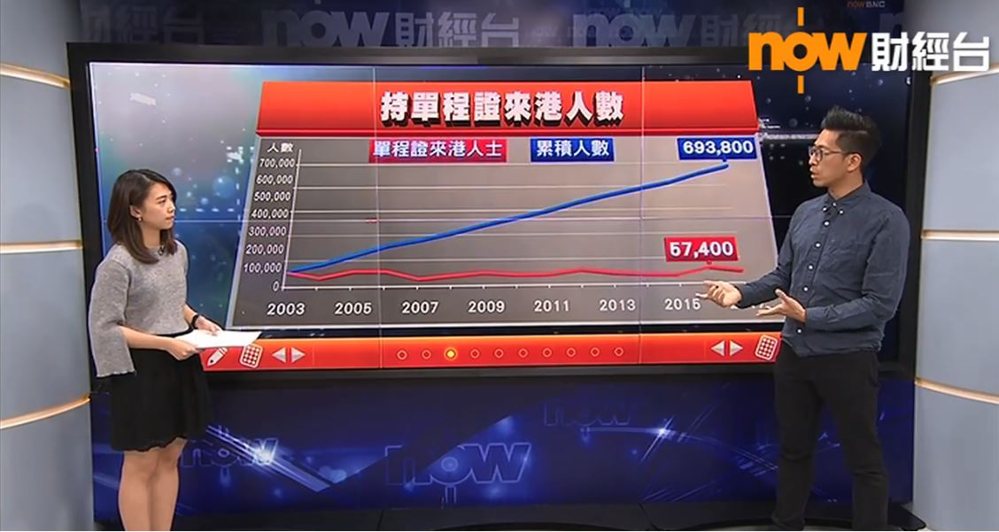
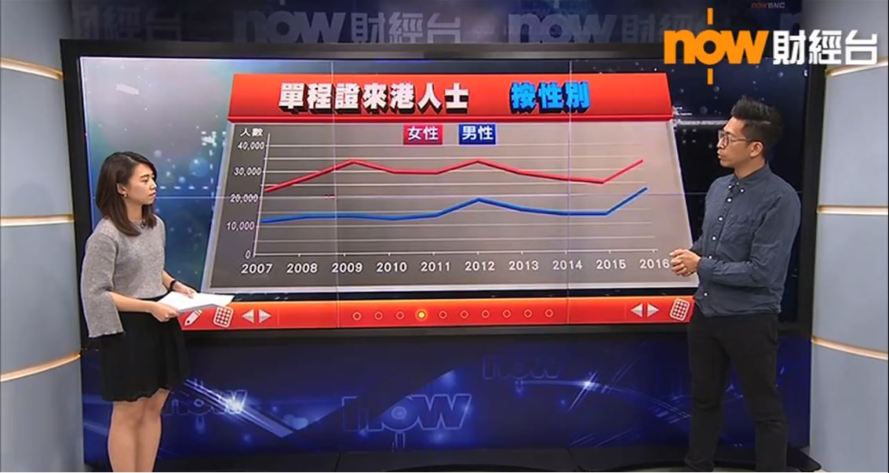
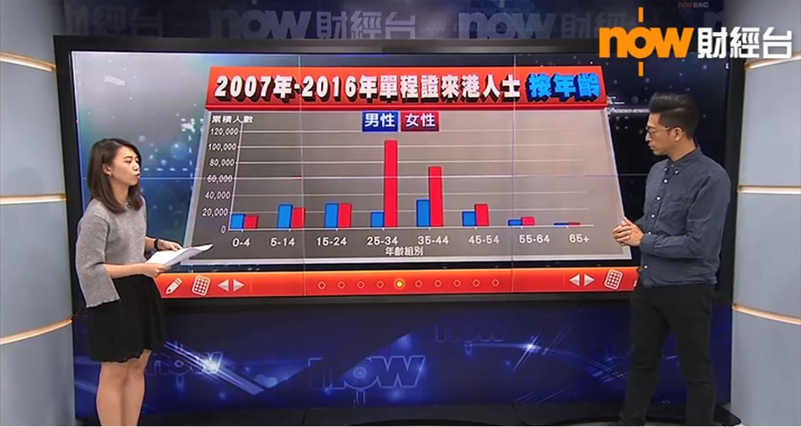
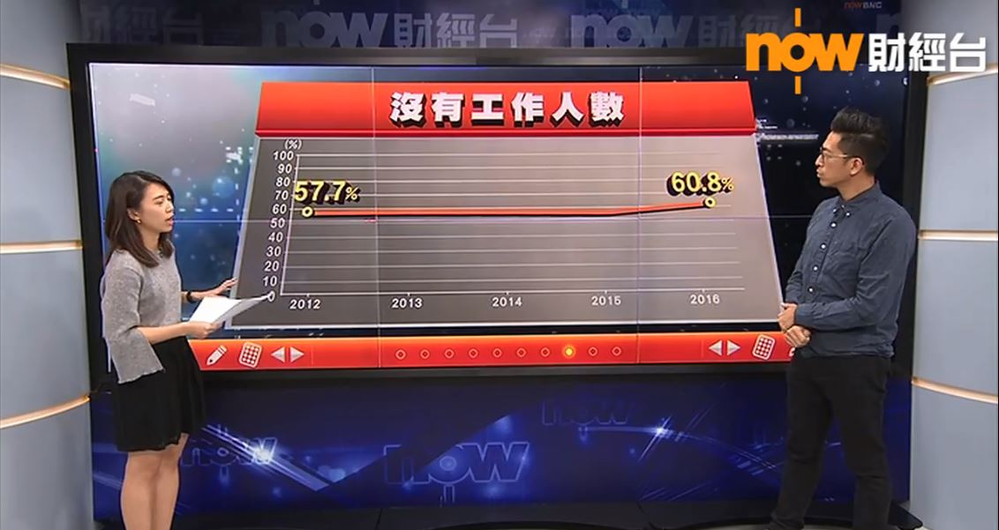
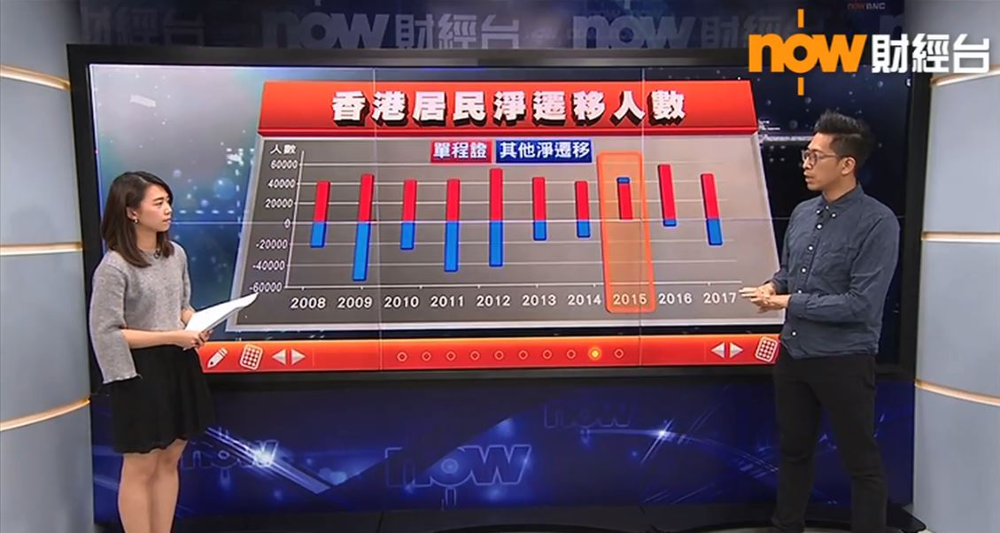
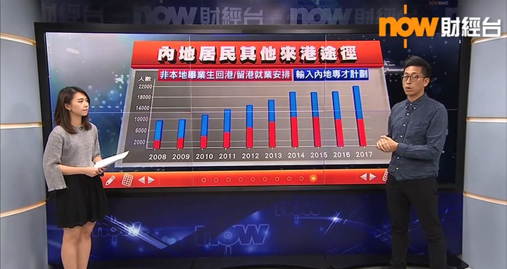

# Topic
-----------------------------
1. Data Journalism introduction
2. NOW TV -Data you know 【數字‧你懂的】


## what is Data Journalism
Data journalism is a journalism specialty reflecting the increased role that numerical data is used in the production and distribution of information in the digital era.--- wiki

(Reporter using data to tell a story)


## Data Journalism history
- William Playfair Commercial and Political Atlas 1786

- John Snow  Cholera Map of London 1854

<iframe width="850" height="620"  src='http://datajournalismhandbook.org/1.0/en/delivering_data_6.html' ></iframe>


## Data Journalism today

- 42% of reporters use data to tell stories regularly (twice or more per week).
- 51% of all news organizations in the U.S. and Europe now have a dedicated data journalist—and this rises to 60% for digital-only platforms.
- 33% of journalists use data for political stories, followed by 28% for finance and 25% for investigative stories.

## Data Journalism today


## Interactive map of gas wells and leases in Australia (ABC News Online)
<iframe width="850" height="620"  src='http://datajournalismhandbook.org/1.0/en/in_the_newsroom_0.html' ></iframe>

## The World at Seven Billion (BBC)
<iframe width="850" height="620"  src='http://datajournalismhandbook.org/1.0/en/in_the_newsroom_1.html' ></iframe>


#NOW TV -Data you know 【數字‧你懂的】


## HK Population  

```{r echo=FALSE, out.width='100%'}

```

## HK Population  

```{r echo=FALSE, out.width='100%'}

```

## HK Population  

```{r echo=FALSE, out.width='100%'}

```

## HK Population  

```{r echo=FALSE, out.width='100%'}

```

## HK Population  

```{r echo=FALSE, out.width='100%'}

```

## HK Population  

```{r echo=FALSE, out.width='100%'}
knitr::include_graphics('./HK006.jpg')
```

## HK Population  

```{r echo=FALSE, out.width='100%'}

```

## HK Population  

```{r echo=FALSE, out.width='100%'}

```

## HK Population  

```{r echo=FALSE, out.width='100%'}

```

## HK Population  

```{r echo=FALSE, out.width='100%'}

```


## HK Population


<video width="850" height="620" controls>
  <source src="Hongkong_population2.mp4" type="video/mp4">
</video>


## Housing affordability rate
<video width="850" height="620" controls>
  <source src="Housing_affordability_rate2.mp4" type="video/mp4">
</video>


# Sample

## Slide with Bullets

- Bullet 1
- Bullet 2
- Bullet 3

## Slide with R Code and Output

```{r}
summary(cars)
```

## Slide with Plot

```{r, echo=FALSE}
plot(cars)
```

