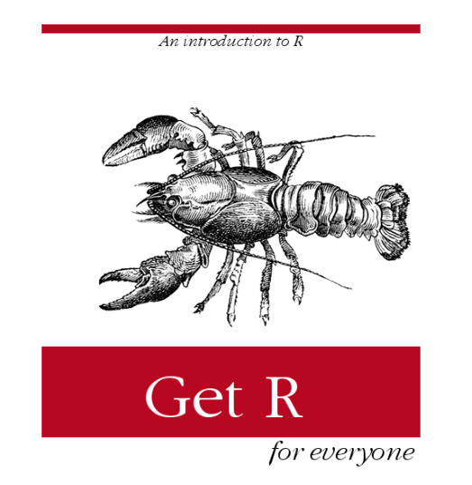
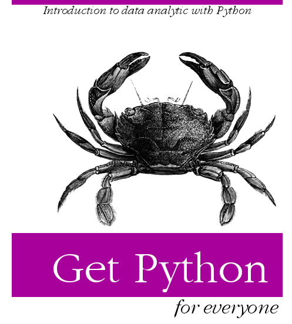

```{r setup, include=FALSE}
knitr::opts_chunk$set(echo = FALSE)
```


## Topic

- Autohotkey 
- R intro
- R Package
- Data import
- Data output


## Book: Get R 


```{r echo=FALSE, out.width='45%'}

```


## Book:Get Python 

```{r echo=FALSE, out.width='40%'}

```
